# Настройка и работа с базой данных Teradata Express

В этой лабораторной работе мы настроим виртуальную машину с предустановленым програмным обеспечением для Терадаты. Также мы загрузим данные в Терадату и подключимся к Терадате через Power BI. 

**Содержание**
* [Настройка виртуальной машины и Teradata Express](#Настройка-виртуальной-машин-и-Teradata-Express)
	* [Скачиваем Teradata](#Скачиваем-Teradata)
	* [Запускаем виртуальную машину](#Запускаем-виртуальную-машину)
	* [Проверяем запущена и работает ли база данных](#Проверяем-запущена-и-работает-ли-база-данных)
* [Доступ к Терадате с внешней сети](#Доступ-к-Терадате-с-внешней-сети)
	* [Подключение к Терадате через DBeaver и загрузка данных](#Подключение-к-Терадате-через-DBeaver-и-загрузка-данных)
	* [Подключение к Терадате через Terada CLI](#Подключение-к-Терадате-через-Terada-CLI)
	* [IMPORT данных в Терадату через CLI](#IMPORT-данных-в-Терадату-через-CLI)
	* [Подключение к Терадате из PowerBI Desktop](#подключение-к-терадате-из-powerbi-desktop)
* [Оптимизация](#оптимизация)
	* [Ассиметрия данных](#ассиметрия-данных)
	* [Статистика](#статистика)
	* [План выполнения запроса](#план-выполнения-запроса)


# Настройка виртуальной машины и Teradata Express

## Скачиваем Teradata
1. Создайте учетную запись на сайте Teradata.com.
2. Перейдите на [страницу загрузки](https://downloads.teradata.com/download/database/teradata-express-for-vmware-player) и сперва ознакомьтесь с требованиями к вашей системе. Самые главные: процессор 64 бит, 30 Гб свободного пространсва и 4 Гб оперативной памяти. Детальные требования – скачайте файл user guide. 
3. Cкачайте версию 16.20.
4. Вы скачали заархивированный файл. Распакуйте файл в удобную для вас папку.

## Запускаем виртуальную машину
Терадата сама по себе не запускается, для этого используется *VMware Player*. Это приложение виртуализации, которое запускает другую операционную систему(виртуальную машину) на вашем компьютере без перезагрузки.
1. Перейдите на сайт [Vmware](https://my.vmware.com/web/vmware/downloads/).
2. В поисковой строке введите *VMware Workstation Player* и скачайте версию 16.20.
Если вы выполнили все предыдущие шаги, то первоначальная подготовка окончена. Запускаем виртуальную машину. 
1. Откройте *VMware Workstation Player*. 

    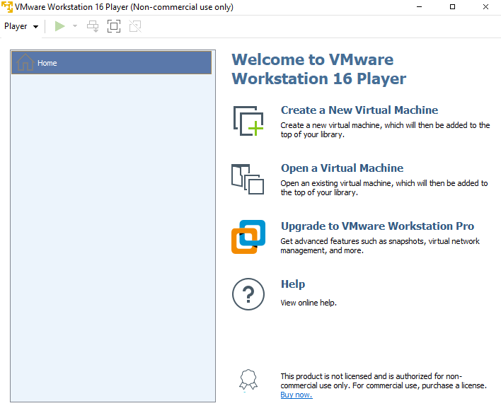

2. Справа в меню выберите **Open a Virtual Machine** и в диалоговом меню перейдите в папку, где разархивировали *Teradata Express* и откройте файл с расширением **.vmx**.
3. Название подгруженного файла виртуально машине появится слева в окне Vmware Player. Кликните на него. Справа появится скриншот и кратакое описание виртуально машины. Нажмите Play Virtual Machine. 

    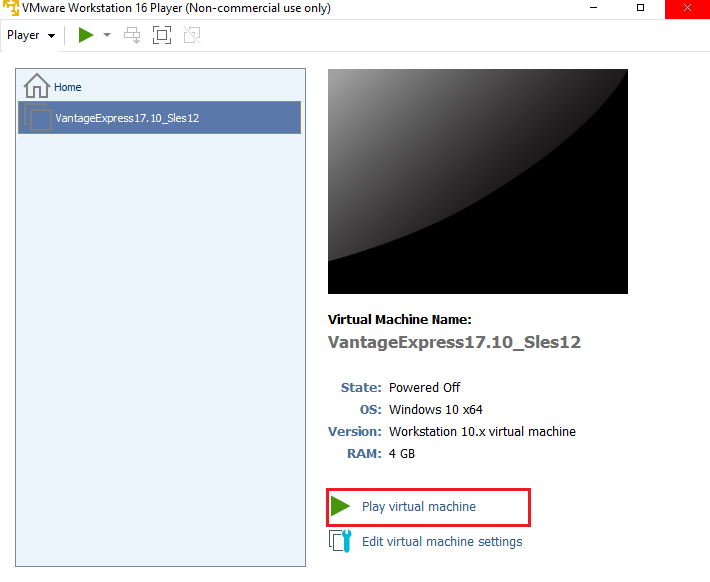

4. Выберите выделенные значения (зависит от версии - возможно и не придется):

    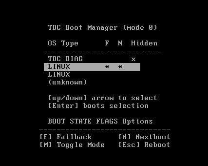

    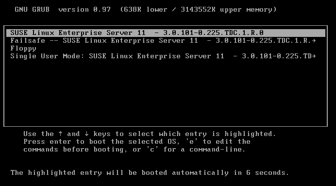

5.	Перед тем, как загрузится операционная ситема Linux(предустановлена), вы должны будете ввести логин и пароль. Возможно 2 раза. Также если появится всплыващее окно Software Updates, нажмите Remind Me Later. 
    
    > Не переживайте если загрузка занимает продолжительнео время - такое может быть.

    - **Login**: *root*
    - **Password**: *root*

6.	В результате должна загрузится операционная система Линукс.
    

## Проверяем запущена и работает ли база данных

1.	На рабочем столе виртуальной машины найдите и запустите Terminal.  Возможно название Gnome Terminal.
2.	Введите следующую команду:

``` 
pdestate -a 
```

3.	Если база данных запущена, то выведется следующее сообщение:
```
PDE state is RUN/STARTED.
DBS state is 5: Logons are enabled – The system is quiescent
```
Если вы получили иное сообщение, то читайте следующий пункт.

4.	Если ваш статус ```DOWN/HARDSTOP``` или ```STOP/KILLTASKS```, то перезагрузите базу данных командой:

    ```tpareset -f reason```

    В ответ на: 

```
You are about to restart the database on the system '<systemname>', Do you wish to continue (default: n) [y,n]
```

Введите ```y``` и нажмите **Enter**.

5.	Через пару минут снова введите команду:

```
pdestate -a 
```
 
Если база данных запущена и работает, вы наконец увидете сообщение:
```
PDE state is RUN/STARTED.
DBS state is 5: Logons are enabled – The system is quiescent
```

Если вы все еще испытываете трудности с запуском базы данных, попробуйте перезапустить ее еще раз. Детали про запуск и остановку базы данных читайте [тут]( https://dbtut.com/index.php/2018/10/27/how-to-start-and-stop-teradata-database/).

## Настройка сети
В плеере VMware мы обычно используем сетевую конфигурацию NAT. Таким образом, VMware управляет базовой виртуальной сетью нашей виртуальной машины и является шлюзом для управления всем входящим и исходящим сетевым трафиком. Этот шлюз предоставляет службу DHCP для назначения IP-адреса экземпляру Teradata Express, а также предоставляет службы DNS для преобразования имен веб-доменов в их IP-адреса. 

Следующие шаги также выполненяйте в терминале вируальной машины.

1.	IP-адрес, назначенный вашему экземпляру Teradata Express, отображается с помощью команды ifconfig:
```
ifconfig eth0
```
Данная команда выведет информацию как на  скриншоте:


IP-адрес для экземпляра Teradata Express - ```192.168.1.55```. У вас, скорее всего, будет другой адрес.

2.	Теперь давайте найдем IP-адрес, который используется для подключения к шлюзу VMware, с помощью команды netstat. 
```
netstat -r
```


IP-адрес шлюза жирным шрифтом - 192.168.1.228. Опять же, у вас, скорее всего, будет другой адрес.

3.	Далее нам нужно записать IP-адрес шлюза в файл ```resolv.config```.  Этот файл содержит адрес нашего сервера доменных имен (DNS), который используется для преобразования сетевых псевдонимов в их IP-адреса. Например, вы не можете просматривать веб-страницы, не переведя имена веб-доменов на их IP-адреса.

Чтобы записать IP-адрес шлюза в файл ```resolv.config```, введите следующую команду:

```
echo “nameserver <ваш IP-адрес шлюза >” > /etc/resolv.conf
```

IP-адрес полученный в шаге 1 настройки сети будем использовать для доступа к Терадате с внешней сети. 

# Доступ к Терадате с внешней сети
Далее мы будем работать не в виртуальной машине, а с внешней сети – с операционной системы на вашем рабочем компьютере.

## Подключение к Терадате через DBeaver и загрузка данных
Вы можете использовать любой инструмент для управления базами данных. Если хотите следовать примеру и у вас нет DBeaver, скачайте [тут]( https://dbeaver.io/download/).
1.	Запустите *DBeaver*.
2.	Создайте новое соединение. **Database > New Database Connection**.
3.	Найдите значок терадаты или введите в поисковой строке Teradata и, соответственно, выберите ее.
4.	Введите следующие параметры:

    - **Host**: *<IP-адрес вашего экзампляра Teradata Express полученный в шаге 1 настройки сети>*
    - **Database/Schema**: *dbc*
    - **Username**: *dbc (по умолчанию для всех юзеров)*
    - **Password**: *dbc (по умолчанию для всех юзеров)*


    Возможно появится всплыващее окно с требованием скачать драйвер для доступа к терадате – скачайте.

5.	Чтобы протестировать, что все работает сделайте SQL запрос. Например:
```
select * from dbc.dbcinfo
```

6.	Откройте файл [INSERT_ORDERS.sql](./INSERT_ORDERS.sql) в *DBeaver* и запустите 3 скрипта по очереди: создание базы данных, таблицы ```orders``` и insert данных в таблицу ```orders```.

## Подключение к Терадате через Terada CLI
1.	Скачайте и установите Teradata Tools and Utilities [ссылка на скачивание](https://downloads.teradata.com/download/tools/teradata-tools-and-utilities-windows-installation-package).
2.	Разархивируйте в удобную для вас папку и запустите файл setup.bat.
3.	Выберите ODBC Driver, BTEQ.

    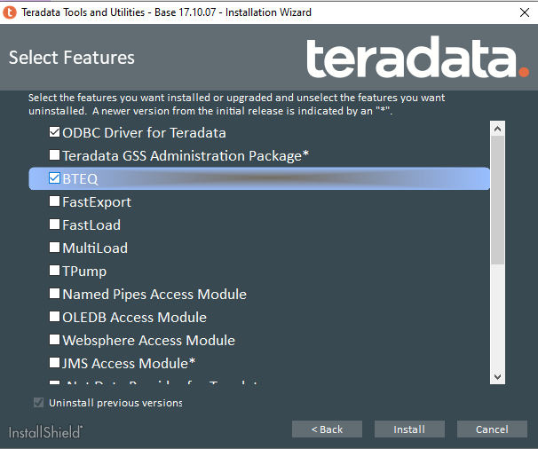

4.	Нажмите **Install**.

5.	[Добавьте в PATH](https://www.architectryan.com/2018/03/17/add-to-the-path-on-windows-10/) ссылку на установленный клиент. На скриншоте показан неозодимый путь. У вас, возможно, будет другая версия, не 17.10.

       

6.	Настройка закончена, теперь можно и попробовать запустить клиент **BTEQ**.
Запустить **Command Prompt(терминал)**, введите ```bteq``` и нажмите **Enter**.

    Должно вывестить похожее сообщение:
```
 Teradata BTEQ 17.10.00.04 (64-bit) for WIN64. PID: 11528
 Copyright 1984-2021 Teradata. All rights reserved.
 Enter your logon or BTEQ command:
```
7.	Далее авторизируйтесь с помощью команды:
```
.logon < IP-адрес вашего экзампляра Teradata Express>/dbc
```

8.	**Пароль** – *dbc*.
9.	Если успешно прошли авторизацию увидете сообщение:

```
*** Logon successfully completed.
```

10.	Для проверки, введите SQL запрос(не забудьте поставить (;) точку с запятой в конце запроса):
```
select count(*) from Superstore_st.orders;
```

11.	Наберите команду для завершения сессии в BTEQ. В коммандной строке наберите:
```
.quit
```

С помощью клиента **BTEQ** также можно импортировать данные в БД из **.csv** файла.


## IMPORT данных в Терадату через CLI

1.	Скопируйте файлы [returns.csv](./returns.csv) и [import_bteq.btq](./import_bteq.btq) в удобную для вас папку(оба файла в одну и ту же папку) на своей рабочем копмьютере (не на виртуальную машину).
2.	Откройте файл **import_bteq.btq** в текстовом редакторе и вместо ```192.168.1.56``` в первой строке вставьте **< IP-адрес вашего экзампляра Teradata Express полученный в шаге 1 настройки сети >**:

    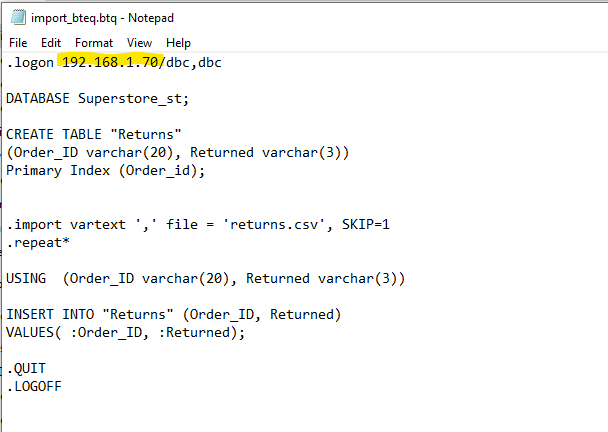

3.	Откройте терминал на своем рабочем копмьютере и перейдите в папку, где вы сохранили **returns.csv** и **import_bteq.btq**:
```
cd <путь к папке>
```
4.	Введите следющую команду, чтобы активировать скрипт для импорта данных из файла returns.csv в Терадату:
```
bteq .run file = import_bteq.btq
```
Выполнение скрипта, по идее, должно занять меньше 20 секунд.

5.	В результате выведется похожее сообщение:
```
*** Total elapsed time was 16 seconds.

 *** Total requests sent to the DBC = 296
 *** Successful requests per second = 74.000

 BTEQ -- Enter your SQL request or BTEQ command:


.QUIT
 *** You are now logged off from the DBC.
 *** Exiting BTEQ...
 *** RC (return code) = 8
```
6.	В результате, если вы снова зайдете в DBeaver в вашей базе данных должно быть 2 таблицы (возможно прийдется сделать refresh: **mouse right click --> refresh**):

    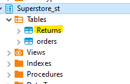

## Подключение к Терадате из PowerBI Desktop

1.	В источниках данных найдите и выберите Teradata Database.
    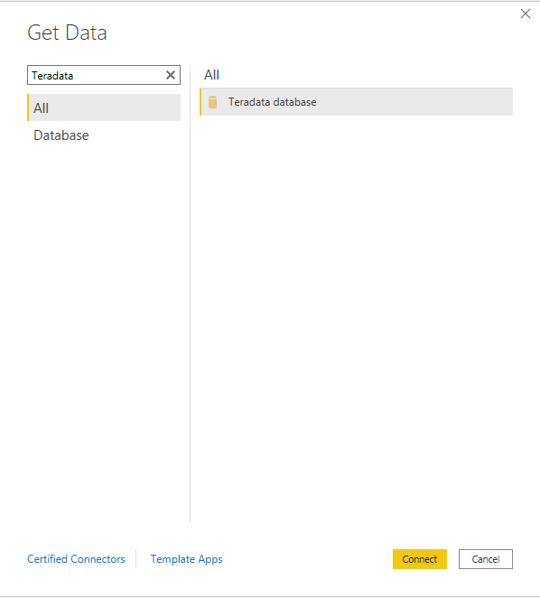

2.	Если на экране появится окно с сообщением ```“This connector requires one of more additional components to be installed before it can be used“```:
    - нажмите на ссылку “Learn more” и вы перейдете на [страницу]( https://downloads.teradata.com/download/connectivity/net-data-provider-for-teradata) для скачивания .NET Data Provider for Teradata. 
    - Cкачайте и установите версию 16.20.09.00. 
    - Закройте виртуальную машину и презапустите компьютер.

    - После перезапуска не забудьте снова запустить виртуальную машину.
    - Запустите снова Power BI и в источниках данных найдите и выберите Teradata Database

3.	В появившемся окне в поле Server введите **< IP-адрес вашего экзампляра Teradata Express полученный в шаге 1 настройки сети >**.

4.	Далее вам нужно авторизироваться:
    - В списке слева выберите *Database*.
    - **Username**: *dbc (по умолчанию для всех юзеров)*
    - **Password**: dbc *(по умолчанию для всех юзеров)*

        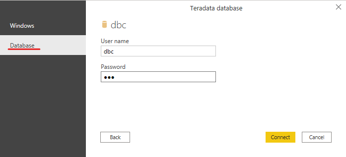

5.	Если все прошло успешно, вы увидете Navigator с возможностью выбрать необходимую таблицу.

    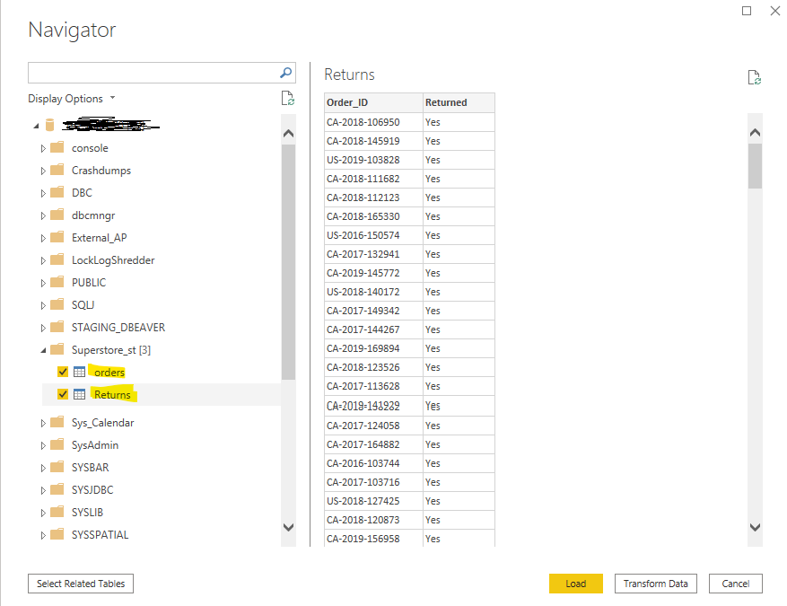

6.	Поздравляем, вы можете строить дашборды и отчетность с Power BI & Teradata.


# Оптимизация

## Ассиметрия данных

AMP (Access Module Processor) - это виртуальный процессор, который отвечает за параллелизм в Teradata, и каждый AMP связан с виртуальным диском, который является подмножеством физического диска. Каждый AMP получает равную долю физического диска и отвечает за все операции с этими данными, независимо от других AMP.В Teradata Express всего 2 AMPs. 

SQL запрос для выяснения колличества AMPs: 
```
SELECT HASHAMP()+1;
```

В идеальных сценариях данные должны распределяться поровну между всеми AMP, и они обрабатывают равные объемы данных. Но из-за асимметрии данных(Data Skew) одни значения могут иметь более высокую частоту по сравнению с другими. В таких случаях алгоритм хеширования Teradata, отвечающий за распределение данных на AMP, выделяет разные объемы данных для каждого AMP - это называется асимметрией данных. Асимметрия данных приводит к асимметричному использованию пространства на каждом AMP.

Следующий запрос определяет, какой AMP имеет больше разрешенного пространства, чем другие AMP в базе данных:

```
select vproc,
currentperm as "Current_Perm"
from dbc.diskspace
where databasename='Superstore_st';
```

Из вышеприведенного вывода запроса мы можем определить, какой AMP содержит искаженные данные.

Следующий запрос определяет, какая таблица содержит перекос по конкретному AMP в базе данных:

```
select vproc,
currentperm as "Current_Perm",
tablename as "Table_Name"
from dbc.tablesize
where databasename='Superstore_st';
```

Ассиметрию данных связывают с не наилучшим образом определеным первичным индексом (Primary Index). Про концепцию первичного индекса читайте [тут]( https://dbtut.com/index.php/2018/08/14/primary-index-concept-in-teradata/).

SQL cкрипты для подбробного изучения ассиметрии данных в Терадате:
- [Статья 1](https://docs.teradata.com/r/ji8nYcbKBTVEaNYVwKF3QQ/tpyqEHBirGpUrTwR4zxicg)
- [Статья 2]( https://dbtut.com/index.php/2018/09/05/hash-functions-to-identify-skewed-data/)

## Статистика
Механиз оптимизации Терадаты предлагает стратегию выполнения для каждого SQL-запроса. Эта стратегия выполнения основана на статистике, собранной в таблицах, используемых в запросе SQL. Статистика по таблице собирается с помощью команды COLLECT STATISTICS. Статистику можно собирать и мпо индексу и по колонке.

Пример запроса на сбор статистики:
```
COLLECT STATISTICS COLUMN(Order_ID) ON Superstore_st.orders ;
```

Читать по сбору статистики:
- Сбор статистики в [документации Терадаты](https://docs.teradata.com/r/e79ET77~NzPDz~Ykinj44w/CxCriiv87~m6ILK8cR7tuA)
- Зачем собирать статистику [(видео)]( https://www.youtube.com/watch?v=DJU7v5FF5ZE&list=PLMrTtbMO6mv-2Ndwo7UxFkImc1CBHrLRI&index=6)


## План выполнения запроса
Команда EXPLAIN возвращает план выполнения парсингового механизма(parsing engine) на простом английском языке. Его можно использовать с любым оператором SQL. Когда запросу предшествует команда EXPLAIN, план выполнения парсингового механизма возвращается пользователю вместо AMP.
Чтобы понять как работает эта команда, в DBeaver введите EXPLAIN вначале любого запроса, например: 
```
EXPLAIN SELECT * from Superstore_st.orders
```

Вместо выдачи данных содержащихся в таблице orders выведется план выполнения запроса

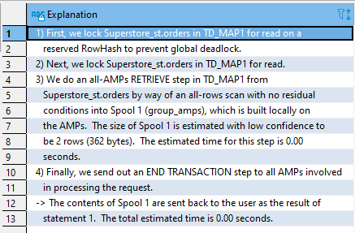


### **Поздравляем — вы закончили это практическое задание!**